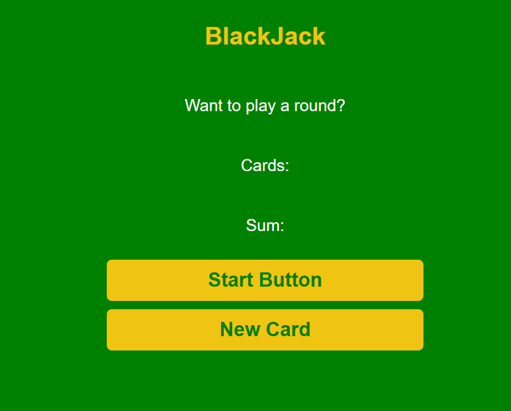

avaScript Blackjack Game

An interactive browser-based Blackjack game built using HTML, CSS, and JavaScript. The game simulates the classic Blackjack experience, allowing players to draw cards, calculate hand values, and compete against the dealer.

---

## ✨ Features

- 🎴 Random card generation
- ➕ Automatic hand value calculation
- 🃏 Draw new cards
- 🏆 Win, lose, and draw conditions
- 🎮 Interactive game controls
- 🔄 Start a new game anytime
- 📱 Responsive and lightweight design

---

## 🛠️ Technologies Used

- HTML5
- CSS3
- JavaScript (ES6)

## 📸 Preview

